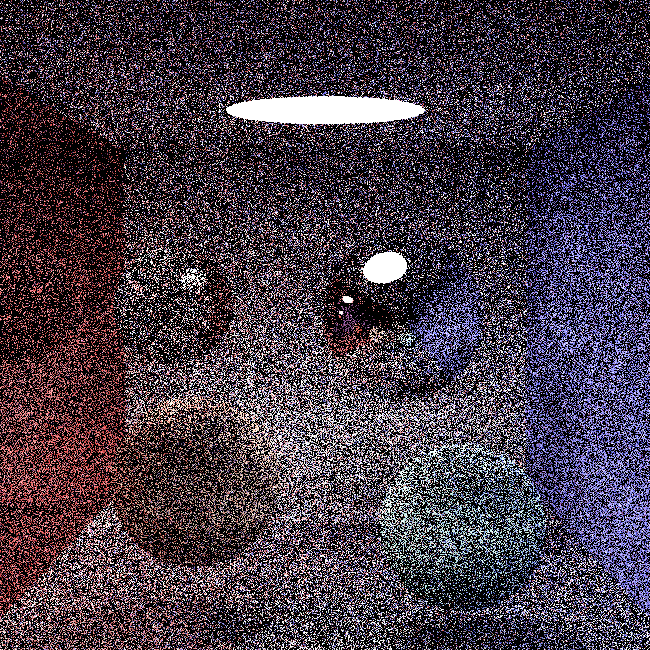

# 真实感渲染大作业报告
刘雅迪
计26
2021010521

## 实现功能
* 路径追踪算法
* 参数曲面解析法求交（验收后增加的功能）
* 复杂网格模型及其求交加速（验收后增加的功能）
* 景深
* 运动模糊
* 抗锯齿（验收后增加的功能）
* 纹理贴图
* 凹凸贴图

## 使用NEE前后的收敛速度和效果对比
1. 使用NEE前
* 缓慢收敛：没有NEE时，路径追踪依赖于随机采样光源方向，这可能导致很多样本未能准确捕捉到场景中的直接照明，特别是在复杂光照环境中（如室内场景或有很多遮挡的场景）。
* 高噪声：由于随机采样可能无法有效击中光源，因此需要大量的样本来减少噪声，实现收敛。


2. 使用NEE后
* 快速收敛：NEE通过直接采样光源的贡献，有效提高了直接照明计算的准确性。这显著减少了噪声，使得图像在较少的样本下也能快速收敛。
* 噪点低：由于直接照明部分的收敛速度提升，总体所需的样本数减少，噪点减少，从而提高了渲染效率。


忽略球的变化，可以看到因为使用的是10采样数，噪点很多，但是使用NEE后的图噪点比没有使用的还是少了点，并且整个图看上去更亮，没有那么暗沉，小图对比：


## 原理
### 路径追踪算法
路径追踪算法主要是通过蒙特卡洛模拟方法，每个像素点发出大量光线，对每条光线经过的折射、镜面反射、漫反射等情况都计算一个概率，通过概率来随机选择一条光线进行追踪，并最终求取期望作为该像素点的颜色。
由于迭代方式比递归方式更快，故最终采用迭代方式写路径追踪算法。
pt算法主要在pathTracing.hpp文件中实现，支持面光源，采用无穷递归的形式，并且终止策略除了光线没有与物体相交外，使用了Russian Routelette，每次根据概率来决定是否终止。
算法基于BRDF的着色（使用蒙特卡洛积分计算着色），支持漫反射、理想折射、理想反射、glossy（光滑面）材质。
此外，算法中增加了NEE（Next Event Estimation）来对光源直接进行采样，从而收敛速度更快。

### 参数曲面解析法求交
通过牛顿迭代法实现参数曲面与射线求交点的算法。牛顿迭代法用于求解非线性方程的根，通过不断逼近，使射线与曲面的距离最小，从而求取交点。
射线方程：r(t) = o + td
参数曲面方程：P(theta, mu)
迭代计算：
* 定义误差向量F(t, theta, mu) = r(t) - P(theta, mu)
* 计算误差向量的平方长度
* 计算雅可比矩阵J，其元素为误差向量对变量t, theta, mu的偏导数
* 使用牛顿迭代法更新向量：(t, theta, mu) <- (t, theta, mu) - J^{-1} * F
* 重复迭代，直到误差向量的长度小于预定阈值或达到最大迭代次数

### 复杂网格模型及其求交加速
我实现的求交加速方式很简单，通过实现一个包围盒，与物体求交前先与包围盒求交，如果射线与包围盒没有交点，则射线一定与物体没有交点，从而实现一定的求交加速。

### 景深
景深指的是相机对焦点前后相对清晰的成像范围，在景深之内的图像比较清晰，而在景深之外的图像则比较模糊。
因此，引入了焦距和光圈半径参数，并且在生成光线时通过随机数来实现对焦效果。
具体代码实现在camera.hpp中。

### 运动模糊
运动模糊即运动中的物体在成像过程中产生模糊，模糊程度与物体运动速度和相机运动速度有关。在t时刻，当物体以$\overrightarrow{v}$的速度移动时，它的残影会出现在$-\overrightarrow{v}t$的方向上，故只需在$-\overrightarrow{v}t$方向上随机选取一点作为出射光的出射点即可实现运动模糊效果。
在本项目中，运动模糊主要考虑物体的运动，而相机不动，因此，在构造运动模糊的物体时会传入一个velocity的参数表示物体的速度。

### 抗锯齿
在每次采样的时候对于画布的渲染引入随机数的扰动，实现抗锯齿的效果，可以让边缘更加的柔和。

### 纹理贴图
基于UV纹理映射的方式，即将二维的纹理图片映射到三维物体上面，通过将被选中的纹理图片的坐标映射到三维物体上的每个点，从而实现三维物体的纹理细节。

### 凹凸贴图
凹凸贴图与纹理贴图类似，不同的是它通过位移向量或法线方向对顶点进行法线方向上高度的偏移，从而实现凹凸效果。

## 代码逻辑
### 路径追踪算法
使用无穷迭代的方式，并选取俄罗斯转盘作为终止策略，计算光线对color的影响。如果光线无法打到物体，则返回color。否则获取击中材质的颜色、法线与下一条光线的起点，直接采样光源位置并估计其对当前交点的贡献，并通过随机数的生成确定下一条光线的方向和类型，根据下一条光线的类型计算其方向，从而累积颜色并增加迭代深度。
对于下一条光线的类型：
1. 镜面反射：不改变颜色，光线方向针对法向做轴对称处理
2. 漫反射：引入了随机数，出射光线方向的分布以镜面反射光线为中心
3. 折射：通过菲涅尔项计算光线发生折射与反射的比例，如果出射光线的折射角小于零，则发生了全反射现象
4. 光滑面glossy：通过cook-torrance BRDF计算
```c++
float Trowbridge_Reitz_GGX_D(Vector3f normal, Vector3f halfVector,float a)
{
    float a2=a*a;
    float NdotH =std::max(Vector3f::dot(normal,halfVector),0.0f);
    float NdotH2 =NdotH*NdotH;
    float nom=a2;
    float denom=(NdotH2*(a2-1.0f)+1.0f);
    denom=M_PI*denom*denom;
    return nom/std::max(denom,0.00001f);
}
float Schick_GGX(float NdotV,float k)
{
    float nom=NdotV;
    float denom=NdotV*(1.0f-k)+k;
    return nom/std::max(denom,0.00001f);
}
float Schick_GGXSmith_G(Vector3f N,Vector3f V,Vector3f L,float k)
{
    k = std::pow(k+1.0f,2.0f)/8.0f;
    float NdotV=std::max(Vector3f::dot(N,V),0.0f);
    float NdotL=std::max(Vector3f::dot(N,L),0.0f);
    float ggx1=Schick_GGX(NdotV,k);
    float ggx2=Schick_GGX(NdotL,k);
    return ggx1*ggx2;
}
    

float Schick_Fresnel_F(float cosTheta,float F0)
{
    return F0+(1.0-F0)*std::pow(1.0-cosTheta,5.0f);
}

class PathTracer{
public:
    const SceneParser& scene;
    int samps; //采样数
    const char* fout; //输出
    PathTracer(const SceneParser& scene, int samps, const char* fout);
    void render();
    Vector3f radiance(Ray ray, Group* group, int depth);
};

PathTracer::PathTracer(const SceneParser& scene, int samps, const char* fout): scene(scene), samps(samps), fout(fout){}

Vector3f PathTracer::radiance(Ray ray, Group* group, int depth){
    Vector3f color = Vector3f::ZERO;
    Vector3f cf = Vector3f::ONE;
    while(true){ //采用迭代的方式
        if(cf.max() < 1e-3) return color;
        // Russian Roulette终止策略
        float p = max(cf.x(), max(cf.y(), cf.z()));
        if (depth > 5) {
            if (RND2 > p) return color;
            cf = cf / p;
        }

        Hit hit;
        if(!group->intersect(ray, hit, 1e-5)){ //如果不相交 //这里tmin不能为0，否则基本是全黑，因为会导致光线在表面上反复hit！
            return color;
        }
        else{
            // 获取相交点的材质信息
            Material* material = hit.getMaterial();
            bool is_texture;
            Vector3f hit_color = hit.getColor(is_texture);
            if (!is_texture)
                hit_color = material->color;
            // 获取材质的自发光颜色、法线和下一条光线的起点
            color += cf * material->getEmissionColor();
            cf = cf * hit_color;
            // cout<<"cf"<<cf.x()<<" "<<cf.y()<<" "<<cf.z()<<"refcolr"<<hit_color.x()<<" "<<hit_color.y()<<" "<<hit_color.z()<<"depth "<<depth<<endl;
            Vector3f hit_emission = material->getEmissionColor();
            Vector3f N = hit.getNormal().normalized();
            Vector3f next_origin = ray.getOrigin() + hit.getT() * ray.getDirection();
            Vector3f ray_direction = ray.getDirection().normalized();

            // 根据随机数生成的类型决策来确定下一条光线的方向和类型
            float random_type = RND2;
            float b = Vector3f::dot(ray_direction, N);
            Vector3f next_direction;

            // NEE（Next Event Estimation）
            // 直接采样光源位置并估计其对当前交点的贡献
            for (int i = 0; i < scene.getNumLights(); ++i) {
                Light* light = scene.getLight(i);
                Vector3f light_dir, light_col;
                light->getIllumination(next_origin, light_dir, light_col);
                float distance_squared = light_dir.squaredLength();
                light_dir.normalized();
                Ray shadow_ray(next_origin, light_dir);
                Hit shadow_hit;
                if (!group->intersect(shadow_ray, shadow_hit, 1e-5)) {
                    color += cf * light_col * max(0.0f, Vector3f::dot(N, light_dir)) / distance_squared;
                }
            }

            //根据类型计算下一条光线的方向
            if(random_type < material->getType().x()){ //漫反射
                Vector3f z_ = Vector3f::cross(ray_direction, N);
                Vector3f x_ = Vector3f::cross(z_, N);
                z_.normalize();
                x_.normalize();
                if (b < 0) next_direction = RND1 * z_ + RND1 * x_ + RND2 * N;
                else next_direction = RND1 * z_ + RND1 * x_ - RND2 * N;
                next_direction.normalize();
                ray = Ray(next_origin, next_direction);
            }
            else if(random_type < material->getType().x() + material->getType().y()){ //镜面反射
                next_direction = ray_direction - N * (2 * b); //光线根据法向做轴变换
                next_direction.normalized();
                ray = Ray(next_origin, next_direction);
            }
            else if(random_type < material->getType().x() + material->getType().y() + material->getType().z()){ //折射
                float n = material->getRefr(); // 折射率
                float R0 = ((1.0 - n) * (1.0 - n)) / ((1.0 + n) * (1.0 + n)); // 被反射光线比例
                if (b > 0) N.negate();
                else n = 1.0 / n;
                
                float cos1 = -Vector3f::dot(N, ray_direction); // 入射角theta余弦值
                float cos2 = 1.0 - n * n * (1.0 - cos1 * cos1); // 出射角theta2 cos(theta2)的平方
                Vector3f reflect = (ray_direction + N * (cos1 * 2));
                if (cos2 < 0) { // 全反射
                    ray = Ray(next_origin, reflect);
                } else {
                    // 用菲涅尔项计算光线在界面上发生反射和折射的概率。
                    float Rprob = R0 + (1.0 - R0) * pow(1.0 - cos1, 5.0);
                    Vector3f refrac = (ray_direction * n) + (N * (n * cos1 - sqrt(cos2)));
                    refrac.normalized();
                    if (cos2 > 0 && RND2 > Rprob) ray = Ray(next_origin, refrac);
                    else ray = Ray(next_origin, reflect);
                }
            }
            else{ //glossy
                Vector3f wo = ray.getDirection();
                double r1 = 2*M_PI*RND2, r2 = RND2, r2s = sqrt(r2);
                Vector3f nl = Vector3f::dot(N, ray.getDirection()) < 0? N: N*(-1);
                Vector3f w = nl;
                Vector3f mm = Vector3f::cross(Vector3f(0, 1, 0), w);
                Vector3f mn = Vector3f::cross(Vector3f(1, 0, 0), w);
                Vector3f u = (fabs(w.x())>0.1? mm : mn).normalized();
                Vector3f v = Vector3f::cross(w, u);
                Vector3f next_direction = (u * cos(r1)*r2s + v*sin(r1)*r2s+w*sqrt(1-r2)).normalized();
                ray = Ray(next_origin, next_direction);
                float alpha = Vector3f::dot(N, wo);
                float roughness=0.02f;
                Vector3f V = next_direction;
                Vector3f L = -wo;
                Vector3f H =(V+L).normalized();
                float D =Trowbridge_Reitz_GGX_D(N,H,roughness);
                float G =Schick_GGXSmith_G(N,V,L,roughness);
                float F = Schick_Fresnel_F(alpha,0.50f);
                float diffsue=Vector3f::dot(N,V)+0.5f;
                float divide=1.0f/(4*std::max(Vector3f::dot(N,L),0.0001f)*std::max(Vector3f::dot(N,V),0.0001f));
                float Specular = D*F*G*divide;
                hit.getMaterial()->diffuseColor = (0.1, 0.1, 0.1);
                Vector3f new_color = diffsue*(hit.getMaterial()->diffuseColor) / M_PI + (hit.getMaterial()->specularColor)*Specular;
                color += new_color;
            }
            depth ++;
        }
    }
    return color;
}
```

### 参数曲面解析法求交
newtonIntersect函数实现了射线与参数曲面相交点的求解：首先检测射线是否与包围盒相交，然后调用getUV函数计算射线与曲线的参数值，使用newton函数，通过牛顿迭代法求解射线与参数曲面的交点point和法线normal。
newton函数执行牛顿迭代，逐步调整参数以求解交点和法线。
getUV函数将射线在t处的空间坐标转换为参数曲面的theta和mu值。
getPoint函数根据theta和mu计算曲面上的点及其切向量。
```c++
bool newtonIntersect(const Ray& r, Hit& h) {
        float t, theta, mu;
        // 检测射线r是否与某个包围盒相交
        if (!bbox.intersect(r, h, t) || t > h.getT()) return false;
        getUV(r, t, theta, mu); // 计算射线与曲线的参数值theta和mu。
        Vector3f normal, point;
        // 利用牛顿迭代法求交点和法线
        if (!newton(r, t, theta, mu, normal, point)) return false;
        // 检查参数值的有效性
        if (!isnormal(mu) || !isnormal(theta) || !isnormal(t)) return false;
        if (t < 0 || mu < pCurve->range[0] || mu > pCurve->range[1] || t > h.getT()) return false;
        h.set(t, material, normal.normalized(), material->getColor(theta / (2 * M_PI), mu), point, material->getTexture().isTexture);
        return true;
    }

    bool newton(const Ray& r, float& t, float& theta, float& mu, Vector3f& normal, Vector3f& point) {
     // 牛顿迭代法 theta:位置参数 [0,2\pi] mu:位置比例 [0,1]
        // 求解交点和法线
        Vector3f dmu, dtheta;
        for (int i = 0; i < newton_depth; ++i) {
            normalizeTheta(theta);
            clampMu(mu);
            // 计算交点和切向量
            point = getPoint(theta, mu, dtheta, dmu);
            Vector3f f = r.getOrigin() + r.getDirection() * t - point;
            if (f.squaredLength() < NEWTON_EPS) return true;
            normal = Vector3f::cross(dmu, dtheta);
            // 牛顿迭代更新参数
            float D = Vector3f::dot(r.getDirection(), normal);
            t -= Vector3f::dot(dmu, Vector3f::cross(dtheta, f)) / D;
            mu -= Vector3f::dot(r.getDirection(), Vector3f::cross(dtheta, f)) / D;
            theta += Vector3f::dot(r.getDirection(), Vector3f::cross(dmu, f)) / D;
        }
        return false;
    }

    void getUV(const Ray& r, const float& t, float& theta, float& mu) {
        Vector3f pt(r.getOrigin() + r.getDirection() * t);
        theta = atan2(-pt.z(), pt.x()) + M_PI;
        mu = (pCurve->y[1] - pt.y()) / (pCurve->y[1] - pCurve->y[0]);
    }

    Vector3f getPoint(const float& theta, const float& mu, Vector3f& dtheta, Vector3f& dmu) {
        //根据给定的参数值theta和mu，计算参数曲面上对应点的位置，并计算该点处的切向量关于theta和mu的偏导数。
        Vector3f pt;
        Quat4f rot;
        rot.setAxisAngle(theta, Vector3f::UP);
        Matrix3f rotMat = Matrix3f::rotation(rot);
        CurvePoint cp;
        pCurve->evaluate(mu);
        for (int j = 0; j < pCurve->s.size(); ++j) {
            cp.V += pCurve->controls[pCurve->lsk + j] * pCurve->s[j];
            cp.T += pCurve->controls[pCurve->lsk + j] * pCurve->ds[j];
        }
        pt = rotMat * cp.V;
        dmu = rotMat * cp.T;
        dtheta = Vector3f(-cp.V.x() * sin(theta), 0, -cp.V.x() * cos(theta));
        return pt;
    }
```

### 复杂网格模型及其求交加速
对包围盒求交：计算x, y, z三个维度的入射光线和出射光线的t，求t_min里面的最大者与t_max里面的最小者即可。
```c++
class Bound{
public:
    void cmin(Vector3f& a, const Vector3f& b){
        if(a.x() > b.x()) a.x() = b.x();
        if(a.y() > b.y()) a.y() = b.y();
        if(a.z() > b.z()) a.z() = b.z();
    }

    void cmax(Vector3f& a, const Vector3f& b){
        if(a.x() < b.x()) a.x() = b.x();
        if(a.y() < b.y()) a.y() = b.y();
        if(a.z() < b.z()) a.z() = b.z();
    }

    Bound(){
        bound[0] = Vector3f(-INF);
        bound[1] = Vector3f(INF);
    }

    Bound(const vector<Vector3f> v, Object3D *obj){
        this->o = obj;
        bound[0] = v[0];
        bound[1] = v[0];
        for(auto i : v){
            cmin(bound[0], i);
            cmax(bound[1], i);
        }
    }

    void set(const Vector3f &lo, const Vector3f &hi){
        bound[0] = lo;
        bound[1] = hi;
    }

    bool intersect(const Ray &r, Hit &h, double tmin){
        Vector3f o(r.getOrigin());
        Vector3f dir(r.getDirection());
        Vector3f invdir(1 / dir);
        vector<int> sgn = { invdir.x() < 0, invdir.y() < 0, invdir.z() < 0 };
        tmin = INF;
        float t_min, t_max, tymin, tymax, tzmin, tzmax;
        t_min = (bound[sgn[0]].x() - o.x()) * invdir.x();
        t_max = (bound[1 - sgn[0]].x() - o.x()) * invdir.x();
        tymin = (bound[sgn[1]].y() - o.y()) * invdir.y();
        tymax = (bound[1 - sgn[1]].y() - o.y()) * invdir.y();
        tzmin = (bound[sgn[2]].z() - o.z()) * invdir.z();
        tzmax = (bound[1 - sgn[2]].z() - o.z()) * invdir.z();
        if ((t_min > tymax) || (tymin > t_max)) return false;
        if (tymin > t_min) t_min = tymin;
        if (tymax < t_max) t_max = tymax;
        if ((t_min > tzmax) || (tzmin > t_max)) return false;
        if (tzmin > t_min) t_min = tzmin;
        if (tzmax < t_max) t_max = tzmax;
        tmin = t_min;
        return true;
    }

protected:
    Object3D *o; //un-transformed object
    Vector3f bound[2];
};
```

### 景深
主要体现在Ray DofCamera::generateRay函数这。首先计算成像平面像素点的相对坐标csx和csy，然后在光圈平面随机取点，得到的点point2与像素点的连线作为相机的射线。
```c++
class DofCamera : public Camera {
    float fxy;
    float distance; // 焦距
    float radius; // 光圈半径
public:
    DofCamera(const Vector3f& center, const Vector3f& direction,
        const Vector3f& up, int imgW, int imgH, float angle, float distance, float radius)
        : Camera(center, direction, up, imgW, imgH), distance(distance), radius(radius)
    {
        // angle is in radian.(弧度制)
        cx = imgW / 2;
        cy = imgH / 2;
        fx = cx / tan(angle / 2);
        fy = cy / tan(angle / 2);
        fxy = imgH / (2 * tan(angle / 2) * (distance + 1));
    }

    Ray generateRay(const Vector2f& point) override
    {
        float csx = distance * (point.x() - cx) / fx;
        float csy = distance * (point.y() - cy) / fy;
        //在光圈上随机采样一个点
        float theta = 2 * M_PI * RND2;
        float r = RND2 * radius;
        float lensX = r * cos(theta);
        float lensY = r * sin(theta);
        Vector3f point2 = lensY * up + lensX * horizontal;
        Vector3f dir(csx - point2.x(), -csy - point2.y(), distance);
        Vector3f lensPoint = center + horizontal * point2.x() - up * point2.y();
        Vector3f finalDir = Matrix3f(horizontal, -up, direction) * dir.normalized();
        return Ray(lensPoint, finalDir);
    }

protected:
    float fx;
    float fy;
    float cx;
    float cy;
};
```

### 运动模糊
还是引入随机数，如果输入的txt文件中包含velocity，代表物体在运动，则会造成中心点的随机偏移。
```c++
bool intersect(const Ray &r, Hit &h, float tmin) override {
        Vector3f origin;
        if(isMove) origin = r.getOrigin() - RND2 * velocity; //运动造成中心点的随机偏移
        else origin = r.getOrigin();
        //...
    }
```

### 抗锯齿
用随机数加入扰动，从而实现抗锯齿效果。
```c++
void PathTracer::render(){
    //...
    for (int s = 0; s < samps; ++s) {
        Ray r = camera->generateRay(Vector2f(x + RND1 , y + RND1 )); //使用画布网格随机扰动的操作，实现抗锯齿效果
        color += radiance(r, group, 0);
    }
}
```

### 纹理贴图
这个纹理类用于加载图片文件并获取纹理颜色和扰动，getColor函数（整数参数）用于获得像素值，并将其归一化到[0, 1]的范围内。getColor（浮点数参数）用于双线性插值计算纹理颜色，getDisturb函数用于计算扰动及其梯度。
```c++
struct Texture {  // 纹理
    unsigned char *picture;
    int width, height, channel;
    bool isTexture;
    Texture(const char *textureFile);
    Vector3f getColor(float u, float v) const;
    Vector3f getColor(int u, int v) const;
    float getDisturb(float u, float v, Vector2f &grad) const;
    inline int getIndex(float u, float v) const;
    inline float getGray(int index) const;
};
```

### 凹凸贴图
利用一个二维梯度实现扰动，f为给定(u, v)坐标的扰动值，通过扰动信息改变法向量的方向，从而实现顶点在表面沿法向进行移动，达到凹凸效果。
```c++
void setHit(Hit &h, float t, Vector3f N, Vector3f P, Material *material){
        // 更新 Hit 对象
        float u = 0.5 + atan2(N.x(), N.z()) / (2 * M_PI);
        float v = 0.5 - asin(N.y()) / M_PI;
        Vector2f grad(0, 0); // 存储凹凸贴图的梯度信息
        float f = material->getBump().getDisturb(u, v, grad);
        if (f > 1e-4 || f < -1e-4) {  //扰动梯度求法向量
            float phi = u * 2 * M_PI;
            float theta = M_PI - v * M_PI;
            Vector3f pu(-N.z(), 0, N.x()), pv(N.y() * cos(phi), -radius * sin(theta), N.y() * sin(phi));
            N = Vector3f::cross(pu + N * grad[0] / (2 * M_PI), pv + N * grad[1] / M_PI).normalized();
        }
        h.set(t, material, N, material->getColor(u, v), P, material->getTexture().isTexture);
    }
```


## 参考代码
https://www.kevinbeason.com/smallpt/
https://github.com/Guangxuan-Xiao/THU-Computer-Graphics-2020/tree/master/project
https://github.com/zrporz/THU-CG-2023
https://github.com/ssloy/tinyraytracer/wiki


## 结果
1. 基础
包含基础的漫反射、镜面反射、折射与抗锯齿效果。
左上角球为透明材质，可以透过球体看到背景经过折射形成的图案（这张图不太明显，但是来不及渲染一张新图了）；右上角球为全反射，可以从中看到在它之外的物体；左下角球和右下角球均为漫反射，其中左下角球展示的是纹理贴图。除左面墙壁为镜面反射外，其他墙壁平面均为漫反射。


2. 景深
无景深：

有景深，焦点在最右边的球体上：


3. glossy材质与凹凸贴图
左边的球为glossy材质，右边的球为凹凸贴图


4. 运动模糊
一个正在做抛物线运动的球


5. 参数曲面加纹理贴图

第二张图曲线点设计的不太好，导致花瓶的下部有一部分是不相连的：


6. 复杂网格模型与求交加速
